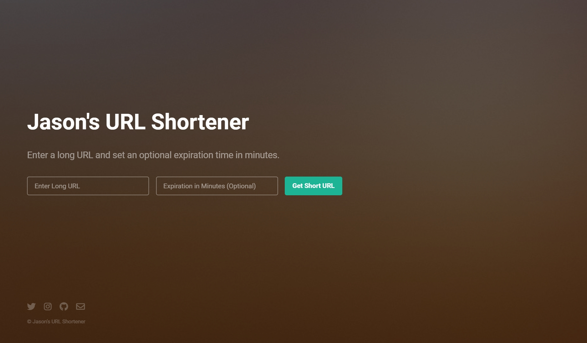

# Jason's URL Shortener

 
**[Live Demo](https://www.jasonurl.com/):**
***https://www.jasonurl.com/***

Jason's URL Shortener API is a scalable, high-performance application for generating and managing shortened URLs with expiration capabilities. Built with FastAPI and Uvicorn, the project ensures reliability, speed, and ease of scaling, making it suitable for both personal and commercial use.

---

## Table of Contents
1. [Features](#features)
2. [Tech Stack](#tech-stack)
3. [API Design](#api-design)
4. [Deployment Considerations](#deployment-considerations)
5. [High Availability & Scalability](#high-availability--scalability)
6. [Getting Started](#getting-started)
7. [File Structure](#file-structure)
8. [License](#license)

---

## Features

### Functional Requirements
- **Generate a Unique Short URL**: Creates a shortened, unique URL for any valid long URL provided by the user.
- **Redirect to Original URL**: When a user accesses a short URL, they are automatically redirected to the original URL.
- **Expiration Support**: Allows setting an expiration time for each shortened URL. Once expired, the URL is no longer accessible and directs users to an "expired" page.

### Operational Requirements
- **High Availability**: The application is designed to be robust, ensuring minimal downtime.
- **Scalability**: Supports scaling out to handle high traffic through load balancing and database sharding.

## Tech Stack

- **Frontend**: HTML, CSS, JavaScript (for user interaction and form handling)
- **Backend**: FastAPI (Python)
- **Server**: Uvicorn (ASGI server for asynchronous Python apps)
- **Database**: Redis (for fast data storage and expiration handling)
- **Proxy Server**: Nginx (for load balancing and proxying requests)
- **Cloudflare Tunnel**: SSL and HTTPS support for secure connections

## API Design

### Endpoints

1. **POST /url/shorten**:
   - **Description**: Accepts a long URL and an optional expiration time in minutes to create a shortened URL.
   - **Request Body**: `{"long_url": "<long_url>", "expiration_minutes": <optional_minutes>}`
   - **Response**: `{"short_url": "<short_url>"}`

2. **GET /url/{short_code}**:
   - **Description**: Redirects to the original URL if the short code is valid and not expired.
   - **Response**: Redirect to original URL or redirect to `/expired` page if expired.

3. **GET /url/check-expiration/{short_code}**:
   - **Description**: Checks the expiration status of a shortened URL.
   - **Response**: `{"expiration_time": "<datetime>"}` if valid; 404 if expired or not found.

### URL Expiration
Expiration is handled through Redis by setting a TTL (Time to Live) on each entry, so expired URLs are automatically removed and inaccessible.

## Deployment Considerations

### Deployment Environment
The URL Shortener API is designed to run in a containerized environment (e.g., Docker) for easy scaling and management. It is optimized for cloud deployment on platforms like AWS or Google Cloud.

### Key Considerations

1. **Reverse Proxy (Nginx)**: Used for serving static files, proxying API requests to the Uvicorn server, and enabling load balancing.
2. **Containerization**: For large-scale deployments, container can manage the scaling and high availability of Uvicorn instances.
3. **Redis Cluster**: A Redis cluster can distribute data across multiple nodes to support higher traffic and redundancy.

## High Availability & Scalability

### Load Balancing
Using Nginx or cloud-native load balancers, traffic can be evenly distributed across multiple instances of the API, preventing bottlenecks and ensuring uptime during high traffic.

### Database Sharding
Redis, used for URL storage and expiration, can be scaled using Redis Cluster to handle larger datasets and distribute load across multiple nodes, allowing high availability.

### Horizontal Scaling
The application can scale horizontally by increasing the number of Uvicorn workers or deploying multiple container instances, enabling concurrent request handling.

### Prerequisites

1. **Python 3.8+** with FastAPI and Uvicorn installed.
2. **Redis** for data storage.
3. **Nginx** configured as a reverse proxy.